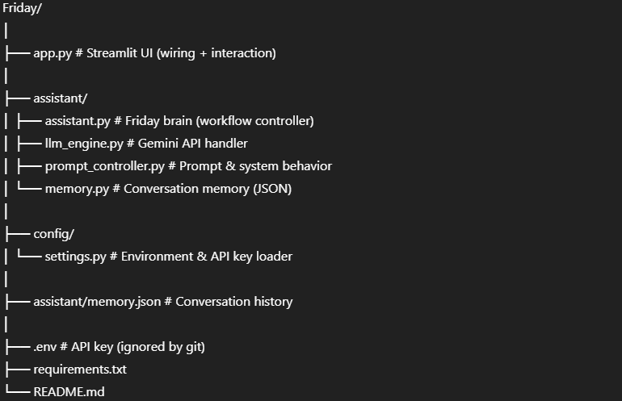
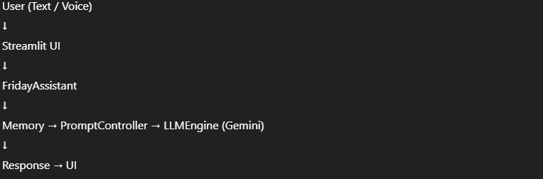

# 🤖 Friday – Personal AI Assistant

Friday is a modular, object-oriented personal AI assistant built using **Python, Streamlit, and Google Gemini API**.  
It is designed to assist users with learning, coding, and career guidance through a clean chat-based interface.

This project demonstrates **OOP principles**, **LLM integration**, **conversation memory**, and **voice input**, following industry-style architecture.

---

### Video Link:

https://drive.google.com/file/d/1jrOWhF9z16XFt169xUGtSbPrBNwkrSxL/view?usp=sharing

---

## 🎯 Features

- 💬 Chat-based AI assistant using Google Gemini
- 🧠 Role-based behavior:
  - Tutor
  - Coding Assistant
  - Career Mentor
- 🗂 Persistent conversation memory (JSON-based)
- 🎤 Voice input (Speech-to-Text)
- 📤 Export conversation as `.txt`
- 🧱 Clean OOP architecture
- 🖥 Streamlit UI
- 🔐 Secure API key handling via `.env`

---

## 🛠 Tech Stack

- **Python 3.10+**
- **Streamlit**
- **Google Gemini API**
- **speechrecognition + PyAudio**
- **python-dotenv**
- **Object-Oriented Programming (OOP)**

---

## 📁 Project Structure



---

## 🧠 Architecture Overview



---

## 🧱 OOP Design

### 1️⃣ `Settings`

- Loads API keys securely from `.env`
- Keeps secrets out of code

### 2️⃣ `Memory`

- Stores conversation in `memory.json`
- Converts history to plain text for LLMs

### 3️⃣ `PromptController`

- Defines Friday’s personality
- Injects role-based instructions
- Formats conversation context

### 4️⃣ `LLMEngine`

- Connects to Google Gemini
- Sends prompts and returns responses
- Handles model interaction only

### 5️⃣ `FridayAssistant`

- Central controller (brain)
- Coordinates:
  - Memory
  - Prompt creation
  - LLM response
- Saves conversation state

---

## 🖥 Streamlit UI

- Chat-style interface
- Sidebar role selection
- Voice input button
- Clear memory option
- Export conversation button

---

## 🎤 Voice Input (Speech-to-Text)

- Uses `speech_recognition`
- Converts microphone input into text
- Text is processed like normal chat input

---

## 📤 Export Conversation

- Download full chat history as `.txt`
- Useful for:
  - Notes
  - Learning logs
  - Debugging
  - Assignment submission

---

## 🔐 Security Best Practices

- API key stored in `.env`
- `.env` excluded from GitHub
- No LLM logic inside `app.py`
- Clear separation of concerns

---

## ▶️ How to Run

### 1️⃣ Clone the Repository

```bash
git clone https://github.com/saquib-hassan/Friday.git
cd Friday
```

### 2️⃣ Create Virtual Environment

```bash
python -m venv venv
venv\Scripts\activate   # Windows

```

### 3️⃣ Install Dependencies

```bash
pip install -r requirements.txt

```

### 4️⃣ Create .env File

```bash
GEMINI_API_KEY=your_api_key_here
```

### 5️⃣ Run the App

```bash
streamlit run app.py
```

## 🧪 Example Use Cases

- Learn Python concepts
- Ask coding questions
- Get career guidance
- Maintain learning conversations
- Voice-driven AI interaction

---

## 🚀 Future Improvements

- Streaming LLM responses from API
- PDF export
- Voice output (Text-to-Speech)
- Multi-session memory
- Model switching (OpenRouter, Grok, etc.)

---

## 👨‍💻 Author

**Saquib Al Hassan**  
Aspiring Applied Gen AI Engineer  
Bangladesh 🇧🇩

---

## 📜 License

This project is for educational and learning purposes.
